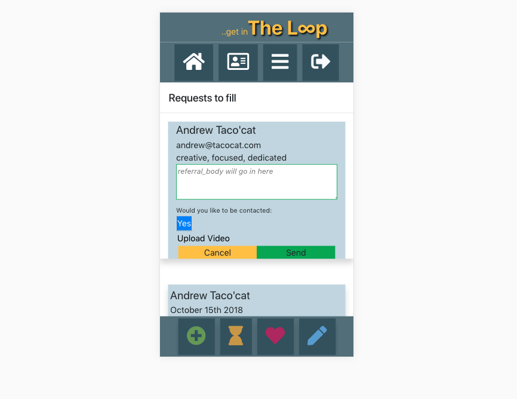

# The Loop

A mobile-first React application that allows users to request, give, and manage professional letters of recommendation.

The Loop is an on-going development project.

## Built With

- React
- Redux / Sagas
- Node.js
- Express
- Moment.js
- nodemon
- Passport
- PostgreSQL
- Boostrap
- Material UI
- Coudinary

## Setup Database
Download and install PostgreSQL. The database for this project should be named "the_loop"

```sql
-- Setup
CREATE TABLE person (
    id SERIAL PRIMARY KEY,
    username VARCHAR (80) UNIQUE NOT NULL,
    password VARCHAR (1000) NOT NULL,
    "admin" BOOLEAN NOT NULL DEFAULT 'FALSE',
    "email" varchar(150) NOT NULL,
    "first_name" varchar(25) NOT NULL,
    "last_name" varchar(25) NOT NULL,
    "employer" varchar(50) NOT NULL,
    "position" varchar(50) NOT NULL,
    "phone_number" varchar(10) NOT NULL,
    "joined_date" DATE NOT NULL,
    "total_req_left" integer NOT NULL DEFAULT '5'
);

CREATE TABLE "new_request" (
    "request_id" serial UNIQUE NOT NULL,
    "date_sent" DATE NOT NULL,
    "owned_by" integer NOT NULL REFERENCES "person",
	"written_from" integer DEFAULT NULL REFERENCES "person",
    "request_body" varchar(420) NOT NULL,
    "suggested_words" varchar(200) NOT NULL,
	"completed" BOOLEAN DEFAULT FALSE,
    CONSTRAINT new_Request_pk PRIMARY KEY ("request_id")
);

CREATE TABLE "industries" (
    "industry_id" serial NOT NULL,
    "industry_name" varchar(100) NOT NULL,
    CONSTRAINT industries_pk PRIMARY KEY ("industry_id")
);

CREATE TABLE "friendship" (
    "friendA_id" integer NOT NULL,
    "friendB_id" integer NOT NULL,
    "friend_status" BOOLEAN NOT NULL DEFAULT 'false'
);

CREATE TABLE "Invitation" (
    "invitation_from" varchar(50) NOT NULL,
    "access_key" varchar(200) NOT NULL UNIQUE,
    "date_created" DATE NOT NULL,
    "activated" BOOLEAN NOT NULL DEFAULT 'FALSE'
);

CREATE TABLE "LinkedIn" (
    "user_id" varchar(200) NOT NULL,
    "linkedin_data" varchar(200) NOT NULL
);

CREATE TABLE "amazon_storage" (
    "referral_id" integer NOT NULL,
    "audio" varchar(50) NOT NULL,
    "video" varchar(50) NOT NULL,
    CONSTRAINT amazon_storage_pk PRIMARY KEY ("referral_id")
);

CREATE TABLE "fill_referral" (
	"new_request_id" integer NOT NULL REFERENCES "new_request",
    "referral_body" varchar(420) NOT NULL,
    "date_created" DATE NOT NULL,
    "aws_links" varchar,
    "can_contact" BOOLEAN NOT NULL DEFAULT 'TRUE',
	"favorite" BOOLEAN NOT NULL DEFAULT 'FALSE'
);
--End Setup
```

### Installing

Steps to get the development environment running.

1. Download this project.
2. `npm install`
3. `npm start`
4. initialize database
5. create an account.
6. open developer tools and select mobile device.

** Adding friendship has not been implemented. This must be done manually in the database using the "friendship" table.

## Screen Shot




### Completed Features

- [x] User Login / Logout
- [x] User view recent recommendations
- [x] Create New Request
- [x] Fulfill request
- [x] View Favorites
- [x] Upload video

### Next Steps

- [ ] Add profile view
- [ ] Finish "pending request" view
- [ ] Add friend feature
- [ ] Add Options page

## Authors

* Jakeh Clark

